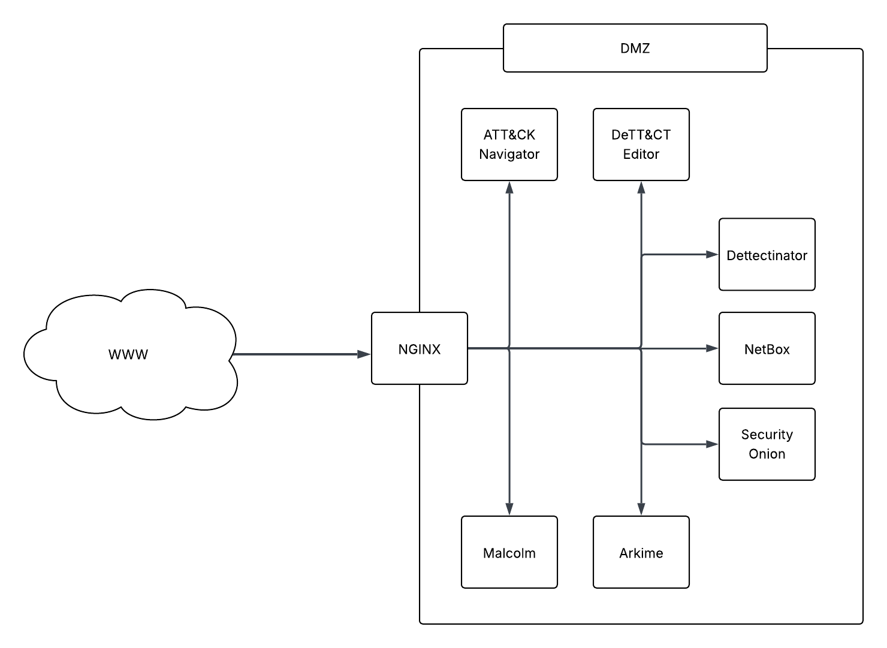

# 🧰 Threat Hunting Tools – Dockerized Environments

> ⚠️ **Note:** This project is brand new and under active development. It will take some time to get every tool configured and documented. Your patience is appreciated as we build this out into a valuable resource for defenders, red teams, and SOC analysts.

---

This repository provides **modern, streamlined setup instructions** for deploying popular threat hunting and network security tools in **Docker environments**. The goal is to make it easier for cybersecurity professionals, lab builders, and blue/red teams to quickly spin up powerful open-source tools without the pain of manual configuration.

⚠️ **This project does not modify or host any third-party software**. Instead, it:

- **Clones the official upstream repositories** (from MITRE, Rabobank, Sirius Security, etc.)
- Provides **Dockerfiles**, `docker-compose.yml`, and build instructions
- Helps you stand up secure, isolated environments for testing and analysis
- Keeps the original code untouched and credits the upstream authors

---

## 🎯 Project Purpose

Security tooling is often fragmented, outdated, or tied to difficult install instructions. This repo consolidates that effort with a focus on:

- **Docker-first deployment**
- Minimal setup effort
- Explicit separation of tools vs infrastructure
- Modern best practices (multi-stage builds, security headers, etc.)

---

## 📦 Dockerized Tools (with Setup Instructions)

| Tool                                                                        | Source              | Description                                    |
| --------------------------------------------------------------------------- | ------------------- | ---------------------------------------------- |
| ✅ [ATT&CK Navigator](https://github.com/mitre-attack/attack-navigator.git)    | MITRE               | Visualize and map threat actor techniques      |
| ⚠️ [attack-navigatorAttrib](https://github.com/dlm225/attack-navigatorAttrib)  | dlm225              | Augmented version of ATT&CK Navigator          |
| ⚠️ [DeTTECT](https://github.com/rabobank-cdc/DeTTECT)                          | Rabobank CDC        | Threat detection coverage and audit planning   |
| ⚠️ [Dettectinator](https://github.com/siriussecurity/dettectinator/)           | Sirius Security     | Simplifies DeTTECT mapping and validation      |
| ✅ [NetBox (Dockerized)](https://github.com/netbox-community/netbox-docker)    | NetBox Community    | Infrastructure resource modeling and inventory |
| ⚠️ [Security Onion](https://github.com/Security-Onion-Solutions/securityonion) | Security Onion Team | Full-stack network security monitoring distro  |
| ⚠️ [Arkime](https://github.com/arkime/arkime)                                  | Arkime Project      | Packet capture and indexing system             |
| ⚠️ [Malcolm](https://github.com/idaholab/Malcolm)                              | CISA                | Network traffic analysis and threat visibility platform |

---

## 🌐 Toward a Unified Threat Hunting Ecosystem (Phase II)

In **Phase II**, this project will expand to provide an end-to-end threat hunting ecosystem. The vision is to deliver a **fully containerized, integrated environment** where all components — from traffic collection and SIEM pipelines to ATT&CK visualizations and asset inventories — operate together cohesively. This will empower blue teams, SOCs, and defenders to:

- Deploy entire threat hunting stacks in minutes
- Correlate detections, visualize posture, and track coverage gaps
- Build repeatable, portable labs for adversary emulation and training

This phase will focus on orchestration, pre-wired data flows, and ecosystem-level documentation.

---

## 🔧 Software Utilities (Manual Installation Only)

These tools are essential for threat hunting and packet analysis, but are **not containerized** in this repository:

- [Nmap](https://nmap.org/) – Network scanning and enumeration
- [ZenMap](https://nmap.org/zenmap/) – GUI frontend for Nmap
- [GrassMarlin](https://github.com/nsacyber/GRASSMARLIN) – Passive ICS/SCADA network mapping
- [tcpdump](https://www.tcpdump.org/) – Command-line packet capture
- [WinDump](https://www.winpcap.org/windump/) – Windows-native tcpdump
- [Wireshark](https://www.wireshark.org/) – GUI packet analysis tool

> 📦 Installation instructions can be found at each tool's official site or GitHub repo.

---

## 🔮 Future Implementations

The following tools are planned for future Dockerized integration in this repository:

| Tool                                                  | Source          | Description                                          |
| ----------------------------------------------------- | --------------- | ---------------------------------------------------- |
| [Caldera](https://github.com/mitre/caldera)           | MITRE           | Automated red team and adversary emulation framework |
| [HELK](https://github.com/Cyb3rWard0g/HELK)           | Cyb3rWard0g     | Elastic-based hunting lab platform                   |
| [TheHive](https://github.com/TheHive-Project/TheHive) | TheHive Project | Collaborative incident response platform             |

---

## 🛡️ Disclaimer

This repository:

- Clones and builds open-source tools from their **official upstream repositories**
- Does **not modify** any original source code
- Is intended for **educational and operational lab use only**
- Does **not provide support** for the original tools — please refer to their maintainers for issues or feature requests

---

## 🧑‍💻 Contributions Welcome

Have a tool you’ve containerized? Want to improve the security posture of one of the setups? Submit a PR or open an issue!

